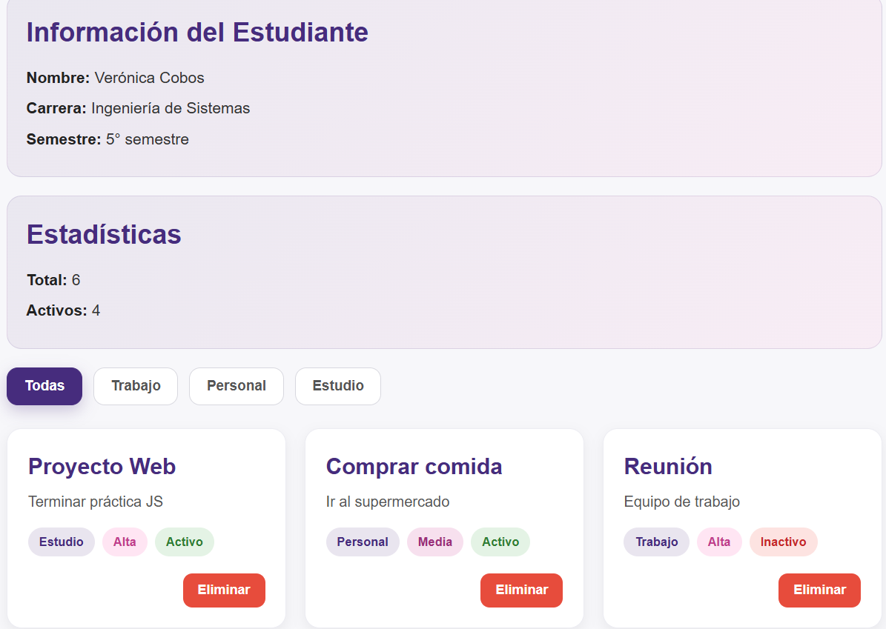
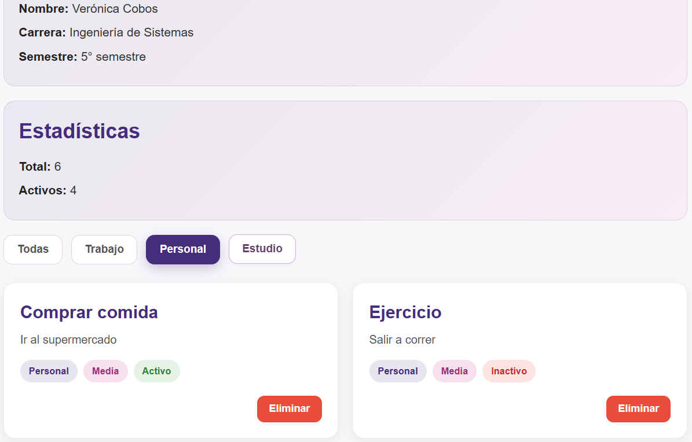

# Práctica 2 - DOM Básico

## Descripción breve de la solución
Esta práctica consiste en desarrollar una aplicación web básica utilizando JavaScript para manipular el DOM.  
La aplicación muestra información del estudiante, estadísticas de elementos, una lista dinámica de tarjetas y un sistema de filtrado por categorías.

Se trabajó con una estructura organizada en HTML, CSS y JavaScript.  
El contenido se renderiza dinámicamente desde `app.js`, permitiendo mostrar datos, filtrar elementos y eliminarlos de la lista en tiempo real.

---

## Fragmentos de código relevantes

### Renderizado de la lista

```javascript
function renderizarLista(datos) {
  const contenedor = document.getElementById('contenedor-lista');
  contenedor.innerHTML = '';

  const fragment = document.createDocumentFragment();

  datos.forEach(el => {
    const card = document.createElement('div');
    card.classList.add('card');

    const titulo = document.createElement('h3');
    titulo.textContent = el.titulo;

    const descripcion = document.createElement('p');
    descripcion.textContent = el.descripcion;

    const categoria = document.createElement('span');
    categoria.textContent = el.categoria;
    categoria.classList.add('badge', 'badge-categoria');

    const prioridad = document.createElement('span');
    prioridad.textContent = el.prioridad;
    prioridad.classList.add('badge');

    if (el.prioridad === 'Alta') {
      prioridad.classList.add('prioridad-alta');
    } else if (el.prioridad === 'Media') {
      prioridad.classList.add('prioridad-media');
    } else {
      prioridad.classList.add('prioridad-baja');
    }

    const estado = document.createElement('span');
    estado.textContent = el.activo ? 'Activo' : 'Inactivo';
    estado.classList.add('badge');
    estado.classList.add(el.activo ? 'estado-activo' : 'estado-inactivo');

    const btnEliminar = document.createElement('button');
    btnEliminar.textContent = 'Eliminar';
    btnEliminar.classList.add('btn-eliminar');

    btnEliminar.addEventListener('click', () => {
      eliminarElemento(el.id);
    });

    const badges = document.createElement('div');
    badges.classList.add('badges');
    badges.appendChild(categoria);
    badges.appendChild(prioridad);
    badges.appendChild(estado);

    const acciones = document.createElement('div');
    acciones.classList.add('card-actions');
    acciones.appendChild(btnEliminar);

    card.appendChild(titulo);
    card.appendChild(descripcion);
    card.appendChild(badges);
    card.appendChild(acciones);

    fragment.appendChild(card);
  });

  contenedor.appendChild(fragment);
  actualizarEstadisticas();
}
```

## Eliminación de elementos
```javascript
function eliminarElemento(id) {
  const index = elementos.findIndex(el => el.id === id);
  if (index !== -1) {
    elementos.splice(index, 1);
    renderizarLista(elementos);
  }
}

```

## Filtrado de elementos
```javascript
function inicializarFiltros() {
  const botones = document.querySelectorAll('.btn-filtro');

  botones.forEach(btn => {
    btn.addEventListener('click', () => {

      const categoria = btn.dataset.categoria;

      document.querySelectorAll('.btn-filtro')
        .forEach(b => b.classList.remove('btn-filtro-activo'));

      btn.classList.add('btn-filtro-activo');

      if (categoria === 'todas') {
        renderizarLista(elementos);
      } else {
        const filtrados = elementos.filter(e => e.categoria === categoria);
        renderizarLista(filtrados);
      }
    });
  });
}

```

## Vista general



## Filtrado aplicado


