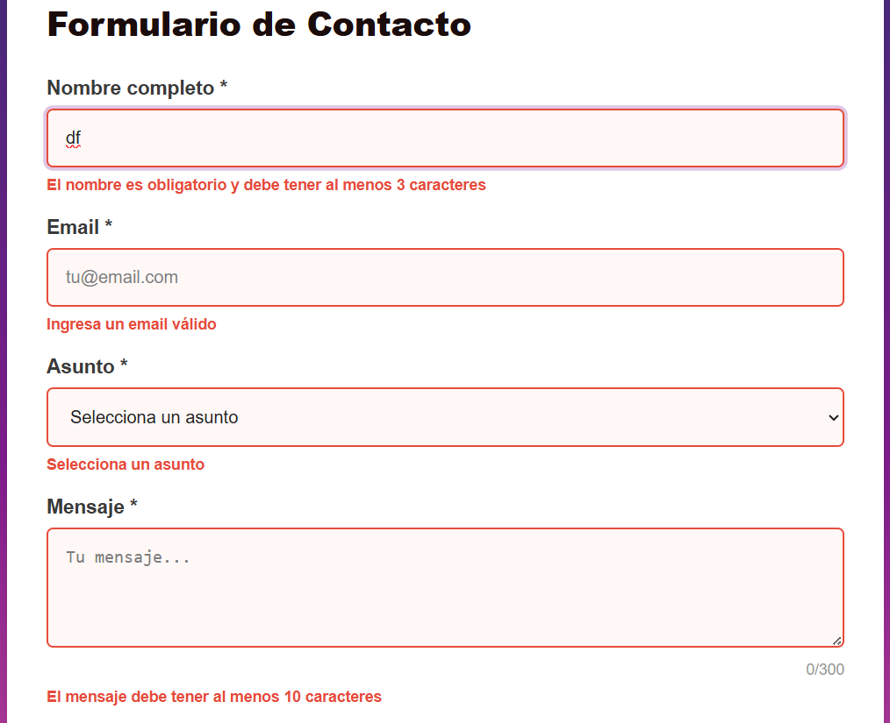
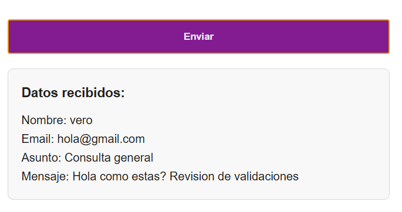
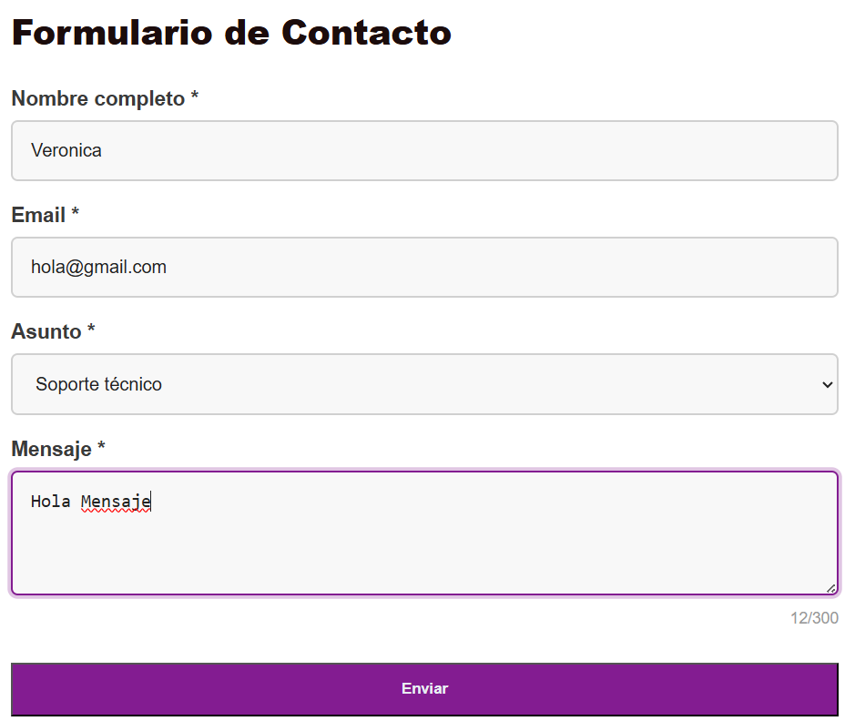
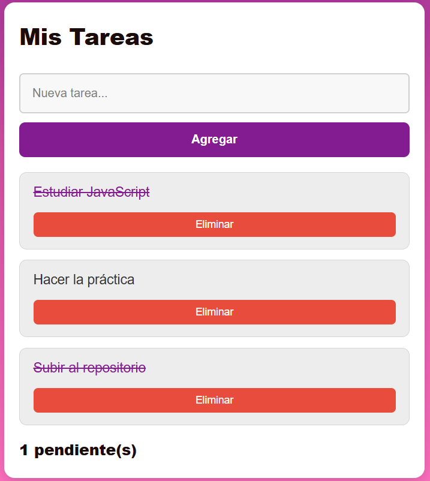
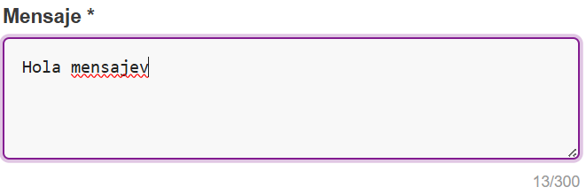

# Práctica 3 – Eventos y DOM

---

## Descripción de la solución

En esta práctica se desarrolló una aplicación web interactiva utilizando JavaScript para manipular el DOM.  
La solución incluye dos módulos principales:

- Formulario de contacto con validación en tiempo real  
- Gestión de tareas con renderizado dinámico  

Se aplicaron eventos como `input`, `blur`, `submit` y `keydown`, además de manipulación de elementos HTML dinámicamente.

---

## Funcionalidades principales

- Validación de formulario con mensajes de error
- Contador de caracteres en tiempo real
- Limpieza automática de errores al escribir
- Envío controlado con `preventDefault()`
- Atajo de teclado Ctrl + Enter
- Lista de tareas dinámica
- Eliminación de tareas
- Marcar tareas como completadas
- Contador de tareas pendientes

---

## 8.2.1 Código destacado

### Validación de formulario con preventDefault()

```javascript
formulario.addEventListener('submit', (e) => {
  e.preventDefault();

  const nombreValido = validarNombre();
  const emailValido = validarEmail();
  const asuntoValido = validarAsunto();
  const mensajeValido = validarMensaje();

  if (nombreValido && emailValido && asuntoValido && mensajeValido) {
    mostrarResultado();
    resetearFormulario();
    return;
  }

  if (!nombreValido) {
    inputNombre.focus();
    return;
  }

  if (!emailValido) {
    inputEmail.focus();
    return;
  }

  if (!asuntoValido) {
    selectAsunto.focus();
    return;
  }

  textMensaje.focus();
});
```

## Event Delegation en la lista de tareas
```javascript
listaTareas.addEventListener('click', (e) => {
  const action = e.target.dataset.action;

  if (!action) return;

  const item = e.target.closest('li');
  if (!item || !item.dataset.id) return;

  const id = Number(item.dataset.id);

  if (action === 'eliminar') {
    tareas = tareas.filter((tarea) => tarea.id !== id);
    renderizarTareas();
    return;
  }

  if (action === 'toggle') {
    const tarea = tareas.find((t) => t.id === id);
    if (tarea) {
      tarea.completada = !tarea.completada;
      renderizarTareas();
    }
  }
});
```
## Atajo de teclado Ctrl + Enter
```javascript
document.addEventListener('keydown', (e) => {
  if (e.ctrlKey && e.key === 'Enter') {
    e.preventDefault();
    formulario.requestSubmit();
  }
});
```
## 8.2.2 Capturas

### Validaciones


Se muestra el formulario con errores visibles cuando los campos no cumplen las condiciones establecidas.  
Los mensajes de error aparecen dinámicamente y los inputs se resaltan para indicar al usuario qué debe corregir.

---

### Formulario procesado correctamente


Se observa el resultado del formulario cuando todos los campos son válidos.  
Los datos ingresados se muestran correctamente en pantalla sin recargar la página.

---

### Event delegation funcionando


Se evidencia cómo los mensajes de error desaparecen automáticamente cuando el usuario comienza a corregir los campos.  
Esto se logra mediante eventos `input` y `change`, mejorando la experiencia del usuario.

---

### Contador de tareas actualizado


Se muestra el contador dinámico de tareas pendientes, el cual se actualiza automáticamente al agregar, eliminar o completar tareas.

---

### Tareas completadas


Se visualiza una tarea marcada como completada, aplicando un estilo tachado.  
Esto confirma el funcionamiento correcto del cambio de estado de las tareas mediante event delegation.

---

### Contador de caracteres


Se muestra el contador de caracteres del campo mensaje, el cual se actualiza en tiempo real mientras el usuario escribe.  
Además, cambia de color cuando se aproxima al límite permitido.
