# Práctica 5 - Asincronía en JavaScript

---

## Descripción

En esta práctica se desarrolló una aplicación web que permite simular el comportamiento de operaciones asíncronas en JavaScript.

La aplicación incluye tres funcionalidades principales:

- Simulación de carga de recursos de forma **secuencial y paralela**
- Implementación de un **temporizador regresivo con barra de progreso**
- Manejo de errores mediante **try/catch y reintentos automáticos**

El objetivo es comprender cómo funcionan las promesas, `async/await`, `Promise.all()` y el control del flujo asíncrono.

---

## Funcionalidades

### 1. Carga secuencial vs paralela

Permite comparar el tiempo de ejecución entre dos formas de realizar peticiones:

- **Secuencial:** una petición se ejecuta después de otra
- **Paralela:** todas las peticiones se ejecutan al mismo tiempo

Se muestra un log en tiempo real y una comparativa final de rendimiento.

---

### 2. Temporizador regresivo

Incluye un temporizador configurable en segundos que:

- Muestra el tiempo en formato `MM:SS`
- Actualiza una barra de progreso
- Cambia a modo alerta cuando quedan ≤ 10 segundos
- Permite iniciar, detener y reiniciar

---

### 3. Manejo de errores

Simula errores en peticiones y permite:

- Capturar errores con `try/catch`
- Mostrar mensajes en la interfaz
- Ejecutar reintentos automáticos con backoff exponencial

---

## Código destacado

### Simulación de petición con Promesa
```javascript
function simularPeticion(nombre, tiempoMin, tiempoMax, fallar = false) {
  return new Promise((resolve, reject) => {
    const tiempo = Math.random() * (tiempoMax - tiempoMin) + tiempoMin;

    setTimeout(() => {
      if (fallar) {
        reject(new Error(`Error al cargar ${nombre}`));
      } else {
        resolve(nombre);
      }
    }, tiempo);
  });
}
```

### Carga secuencial
```javascript
const usuario = await simularPeticion('Usuario');
const posts = await simularPeticion('Posts');
const comentarios = await simularPeticion('Comentarios');
```
### Carga paralela
```javascript
const resultados = await Promise.all([
  simularPeticion('Usuario'),
  simularPeticion('Posts'),
  simularPeticion('Comentarios')
]);
```
### Manejo de errores
```javascript
try {
  await simularPeticion('API', 500, 1000, true);
} catch (error) {
  console.log(error.message);
}
```
### Temporizador con setInterval
```javascript
intervaloId = setInterval(() => {
  tiempoRestante--;
  actualizarDisplay();
}, 1000);
```

## Capturas

### Estructura del proyecto
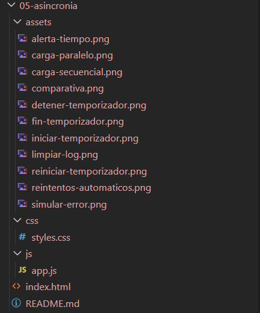

**Descripción:** Organización del proyecto con carpetas separadas para HTML, CSS, JavaScript y recursos visuales.

---

### Carga secuencial
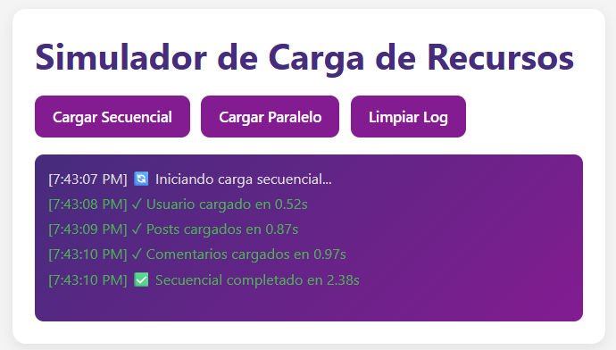

**Descripción:** Las peticiones se ejecutan una tras otra, acumulando el tiempo total de ejecución.

---

### Carga paralela
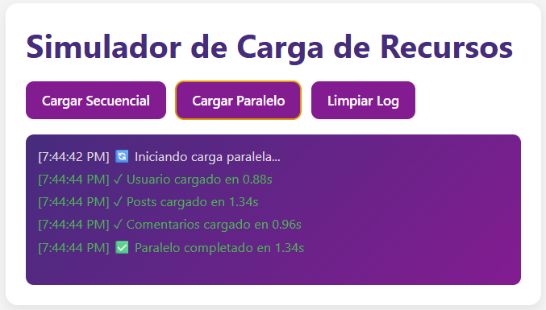

**Descripción:** Las peticiones se ejecutan simultáneamente usando `Promise.all()`, reduciendo el tiempo total.

---

### Comparativa de rendimiento
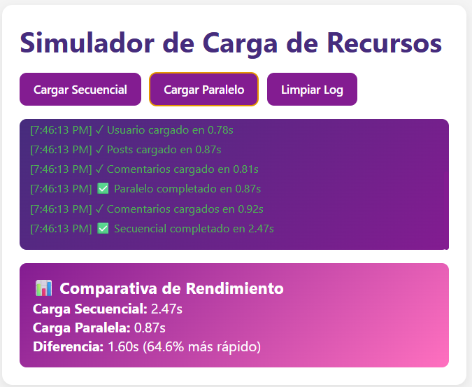

**Descripción:** Se muestra la diferencia de tiempo entre carga secuencial y paralela, evidenciando que la paralela es más rápida.

---

### Iniciar temporizador
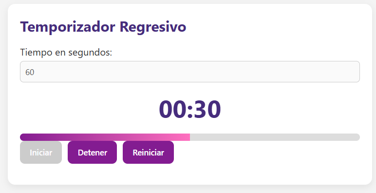

**Descripción:** El temporizador comienza a contar regresivamente y la barra de progreso inicia su avance.

---

### Detener temporizador
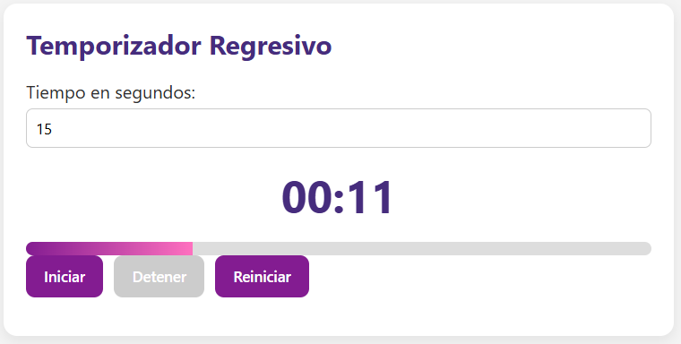

**Descripción:** El temporizador se pausa correctamente y conserva el tiempo restante.

---

### Reiniciar temporizador
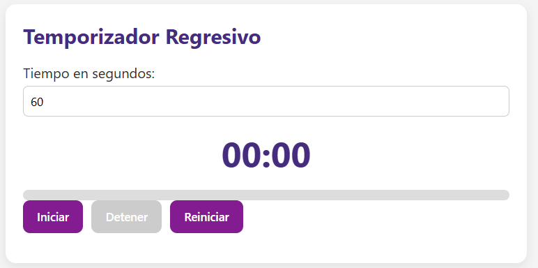

**Descripción:** El temporizador vuelve a su estado inicial (00:00) y la barra de progreso se reinicia.

---

### Alerta de tiempo
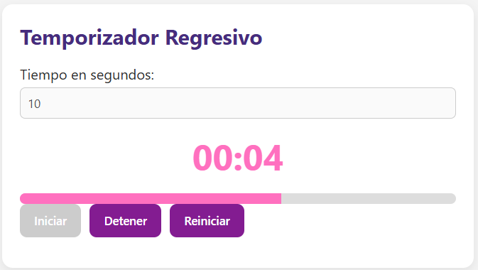

**Descripción:** Cuando quedan 10 segundos o menos, el temporizador entra en estado de alerta visual.

---

### Fin del temporizador
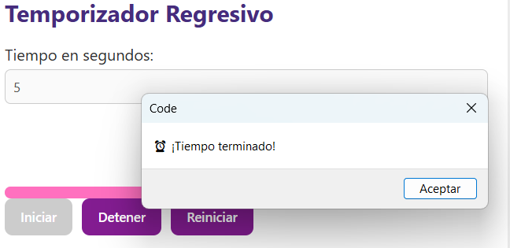

**Descripción:** El temporizador llega a cero y muestra una alerta indicando que el tiempo ha terminado.

---

### Limpiar log
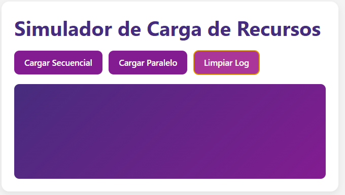

**Descripción:** Se limpia completamente el registro de eventos y desaparece la comparativa.

---

### Simular error
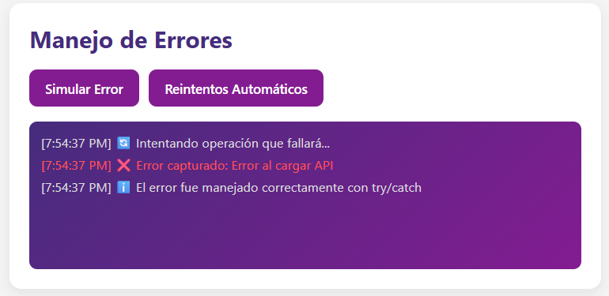

**Descripción:** Se genera un error controlado que es capturado correctamente con `try/catch`.

---

### Reintentos automáticos
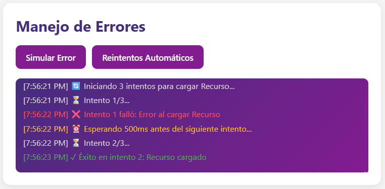

**Descripción:** Se realizan múltiples intentos con tiempos de espera crecientes hasta lograr éxito o fallar definitivamente.