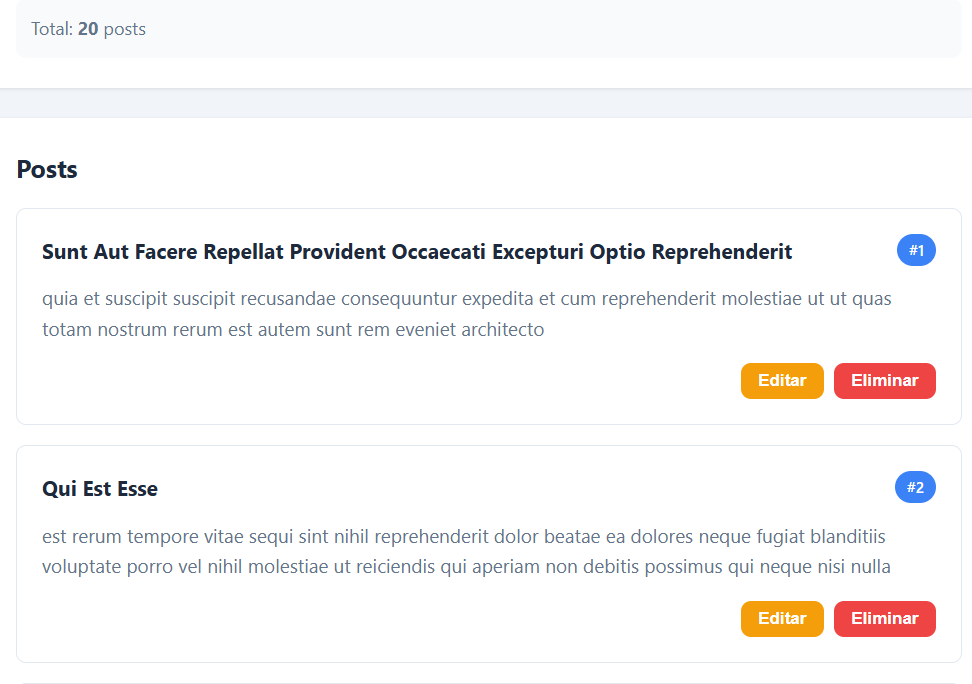
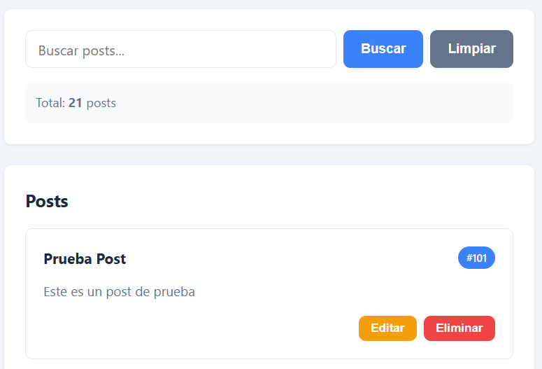
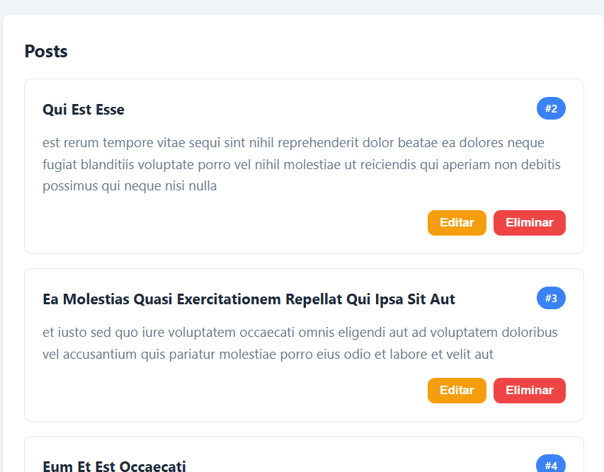
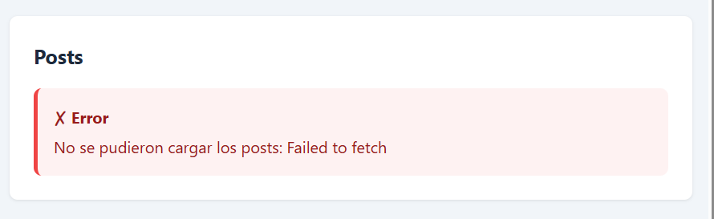
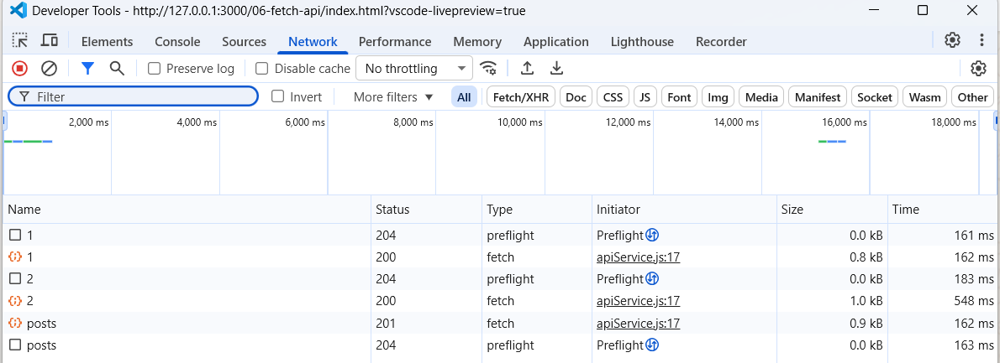

# 8. Resultados y Evidencias

## Capturas requeridas

---

### 1. Datos cargados desde la API


**Descripción:**  
Se obtienen 20 registros desde la API utilizando una petición **GET** a `/posts?_limit=20`.  
Los datos son renderizados dinámicamente en la página mediante manipulación del DOM (createElement, appendChild), mostrando título, contenido e ID de cada post.

---

### 2. Spinner (Estado de carga)


**Descripción:**  
Se muestra un spinner mientras se realiza la petición a la API.  
Esto indica al usuario que los datos están siendo cargados antes de renderizar la lista.

---

### 3. Crear (POST)


**Descripción:**  
Se envía el formulario para crear un nuevo post mediante una petición **POST** a `/posts`.  
El nuevo elemento aparece al inicio de la lista y el contador de posts se actualiza correctamente.

---

### 4. Editar (PUT)


**Descripción:**  
Se edita un post existente mediante una petición **PUT** a `/posts/{id}`.  
Los cambios se reflejan inmediatamente en la interfaz, mostrando el contenido actualizado.

---

### 5. Eliminar (DELETE)


**Descripción:**  
Se elimina un post mediante una petición **DELETE** a `/posts/{id}`.  
El elemento desaparece de la lista y el contador se actualiza correctamente.

---

### 6. Manejo de errores


**Descripción:**  
Se muestra un mensaje de error cuando falla una petición (por ejemplo, error de red o URL incorrecta).  
El error se presenta visualmente en la interfaz, no solo en la consola.

---

### 7. DevTools - Network


**Descripción:**  
En la pestaña **Network** de DevTools se observan las peticiones HTTP realizadas:
- GET para obtener datos  
- POST para crear  
- PUT para actualizar  
- DELETE para eliminar  

Se verifican los headers, payload y respuestas del servidor.

---

### 8. Código (API Service y Componentes)
```javascript
 async getPosts(limit = 10) {
    return this.request(`/posts?_limit=${limit}`);
  },

  async getPostById(id) {
    return this.request(`/posts/${id}`);
  },

  async createPost(postData) {
    return this.request('/posts', {
      method: 'POST',
      body: JSON.stringify(postData)
    });
  },

  async updatePost(id, postData) {
    return this.request(`/posts/${id}`, {
      method: 'PUT',
      body: JSON.stringify(postData)
    });
  },

  async deletePost(id) {
    return this.request(`/posts/${id}`, { 
      method: 'DELETE' 
    });
  },
```

**Descripción:**  
Se muestran capturas del código implementado:
- Servicio API (`apiService.js`) con métodos GET, POST, PUT y DELETE  
- Componentes (`components.js`) creados con la API del DOM  
- Uso de async/await y manejo de errores con `response.ok`

---

## Notas finales

- Se implementó correctamente el CRUD completo usando **Fetch API**  
- Se utilizó manipulación segura del DOM (**sin innerHTML para datos dinámicos**)  
- Se manejaron estados de carga, éxito y error  
- Todas las peticiones HTTP fueron verificadas en DevTools  