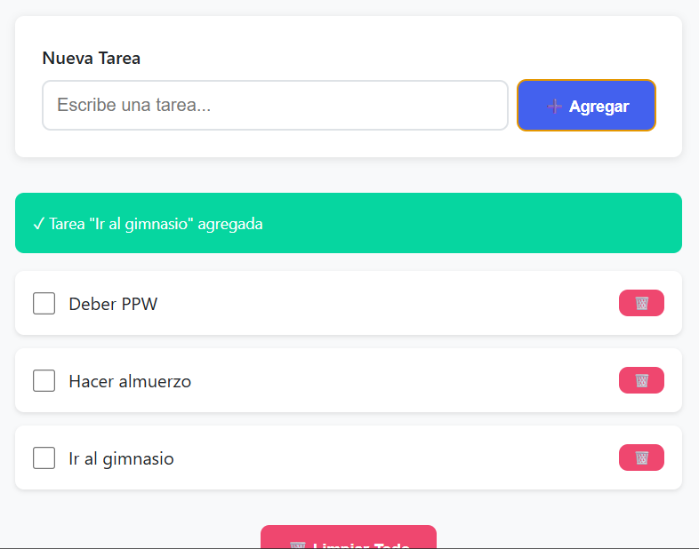
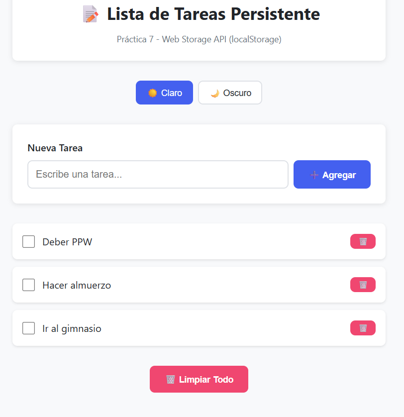
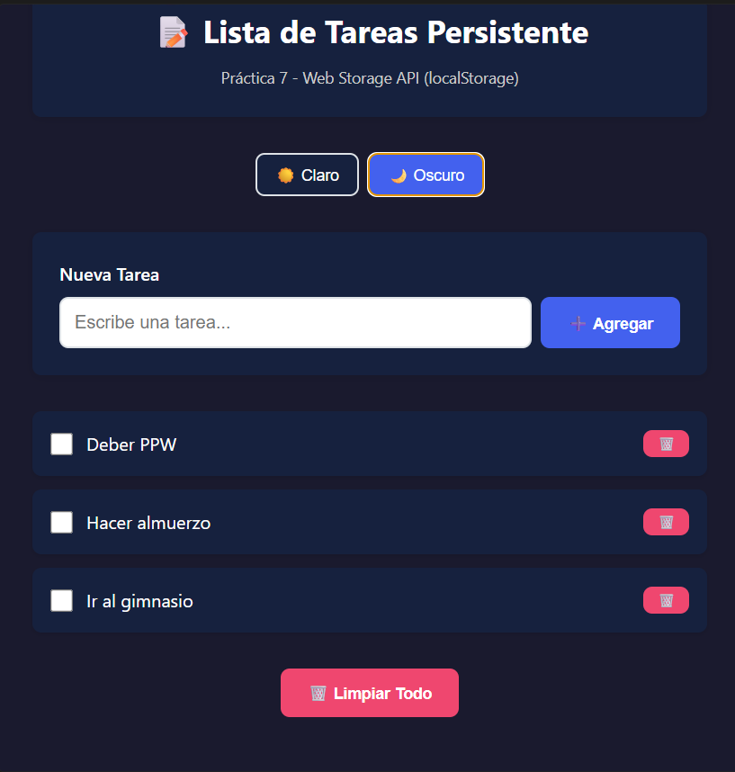
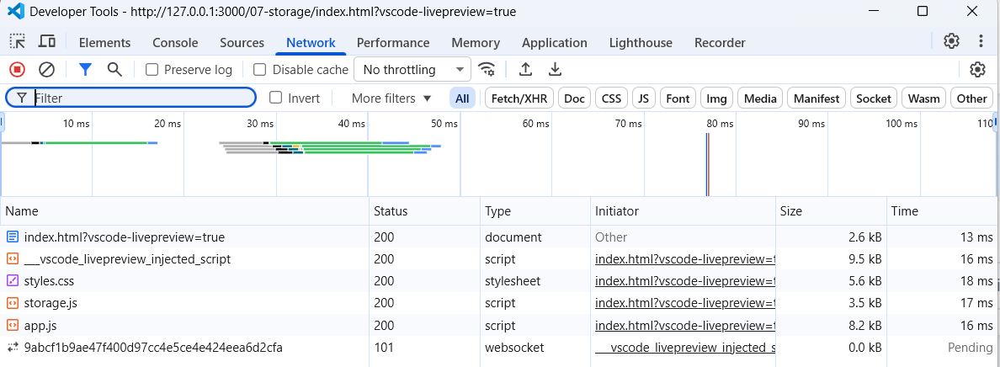

# Práctica 07 - Web Storage | Lista de Tareas

Aplicación web de lista de tareas con persistencia usando **localStorage**.  
Permite crear, completar, eliminar tareas y cambiar entre tema claro/oscuro.

---

# 8. Resultados y Evidencias

## 1. Lista con datos persistentes
  
**Descripción:** Se crearon varias tareas y al recargar la página, estas permanecen visibles, demostrando el uso correcto de localStorage.

---

## 2. Persistencia de datos
  
**Descripción:** Se recargó la página y las tareas continúan almacenadas, confirmando la persistencia de datos.

---

## 3. Cambio de tema
  
**Descripción:** Se aplicó el tema oscuro y se mantuvo después de recargar la página.

---

## 4. DevTools - Local Storage
  
**Descripción:** En Application > Local Storage se visualizan las claves `tareas_lista` y `tema_app` con sus respectivos valores en formato JSON.

---

## 5. Código fuente
  
**Descripción:** Capturas del código en los archivos `storage.js` y `app.js`, donde se implementa la lógica de almacenamiento y manipulación de tareas.

---

# Código Implementado

## storage.js
**Descripción:** Maneja toda la lógica de almacenamiento en `localStorage`.

```js
crear(texto) {
  const tareas = this.getAll();

  const nueva = {
    id: Date.now(),
    texto: texto.trim(),
    completada: false
  };

  tareas.push(nueva);
  this.guardar(tareas);

  return nueva;
}

toggleCompletada(id) {
  const tareas = this.getAll();
  const tarea = tareas.find(t => t.id === id);

  if (tarea) {
    tarea.completada = !tarea.completada;
  }

  this.guardar(tareas);
}

eliminar(id) {
  const tareas = this.getAll();
  const filtradas = tareas.filter(t => t.id !== id);
  this.guardar(filtradas);
}

limpiarTodo() {
  localStorage.removeItem(this.CLAVE);
}
```

## app.js

**Descripción:** Controla la interacción con el usuario y el DOM.

```javascript
function toggleTarea(id) {
  TareaStorage.toggleCompletada(id);
  tareas = TareaStorage.getAll();
  renderizarTareas();
}

function eliminarTarea(id) {
  const tarea = tareas.find(t => t.id === id);

  if (!confirm(`¿Eliminar "${tarea.texto}"?`)) return;

  TareaStorage.eliminar(id);
  tareas = TareaStorage.getAll();
  renderizarTareas();

  mostrarMensaje(`🗑️ Tarea eliminada`);
}

function limpiarTodo() {
  if (tareas.length === 0) {
    mostrarMensaje('No hay tareas para eliminar', 'error');
    return;
  }

  if (!confirm('¿Eliminar TODAS las tareas?')) return;

  TareaStorage.limpiarTodo();
  tareas = [];
  renderizarTareas();

  mostrarMensaje('🧹 Todas las tareas eliminadas');
}

function aplicarTema(nombreTema) {
  if (nombreTema === 'oscuro') {
    document.documentElement.style.setProperty('--bg-primary', '#1a1a2e');
    document.documentElement.style.setProperty('--card-bg', '#16213e');
    document.documentElement.style.setProperty('--text-primary', '#ffffff');
    document.documentElement.style.setProperty('--text-secondary', '#cccccc');
  } else {
    document.documentElement.style.removeProperty('--bg-primary');
    document.documentElement.style.removeProperty('--card-bg');
    document.documentElement.style.removeProperty('--text-primary');
    document.documentElement.style.removeProperty('--text-secondary');
  }

  themeBtns.forEach(btn => {
    btn.classList.toggle('theme-btn--active', btn.dataset.theme === nombreTema);
  });

  TemaStorage.setTema(nombreTema);
}
```


