## 8. Resultados y Evidencias

### Formulario vacío con botón deshabilitado - Vista inicial
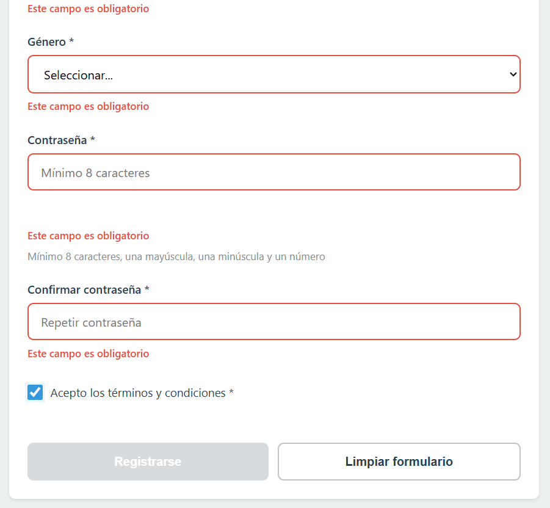  
Vista inicial del formulario: todos los campos vacíos y el botón de envío deshabilitado para evitar envíos incompletos.

---

### Errores de validación
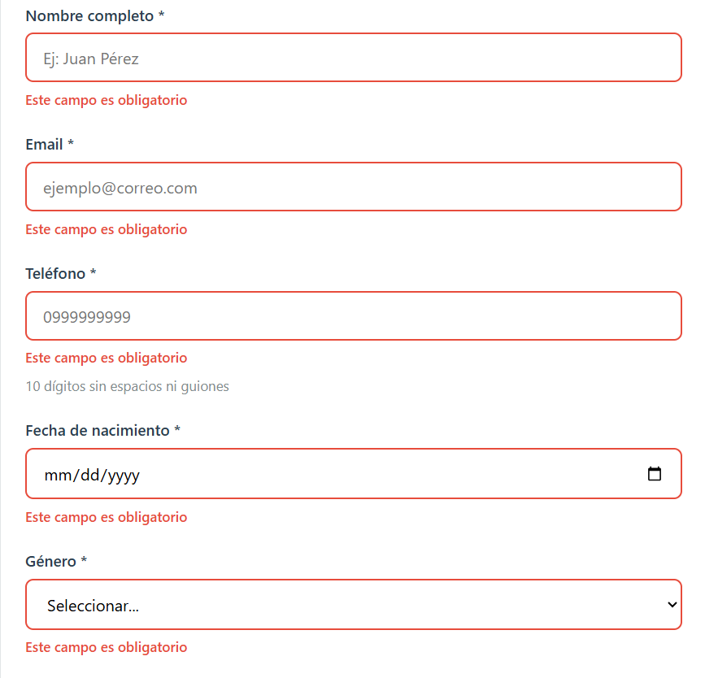  
Múltiples campos muestran borde rojo y mensajes específicos indicando los errores detectados.

---

### Campos válidos
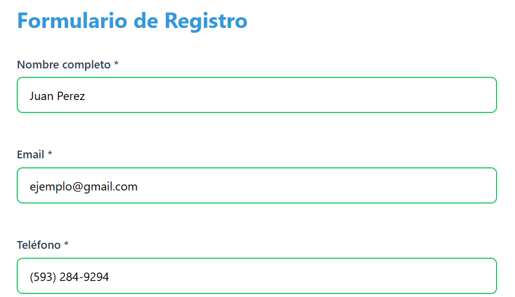  
Los campos correctamente llenados se muestran con borde verde, indicando que cumplen las reglas de validación.

---

### Indicador de fuerza de contraseña
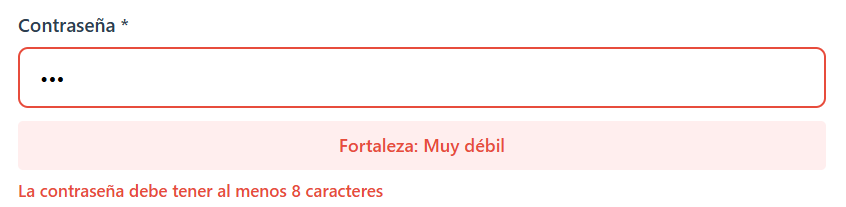  
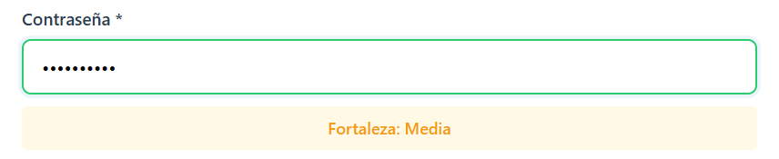  
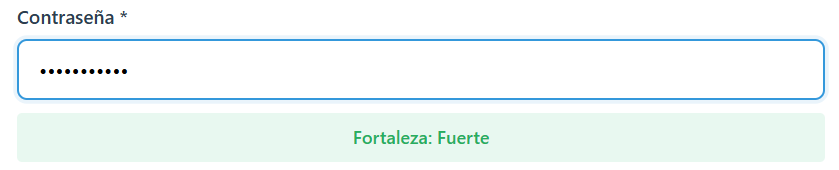  
El sistema evalúa la fortaleza de la contraseña mostrando distintos niveles: débil, media y fuerte.

---

### Error de contraseñas no coinciden
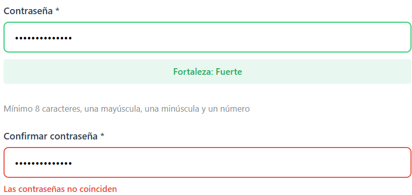  
El campo de confirmación muestra un mensaje de error cuando la contraseña no coincide con la principal.

---

### Máscara de teléfono
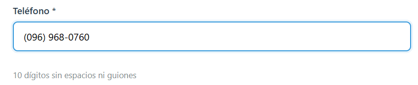  
El campo de teléfono aplica formato automático: `(099) 999-9999`.

---

### Envío exitoso
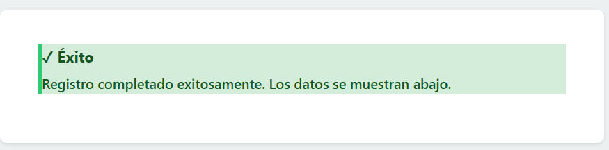  
Mensaje verde confirmando el registro exitoso y mostrando los datos ingresados.

---

### Tarjeta de resultado
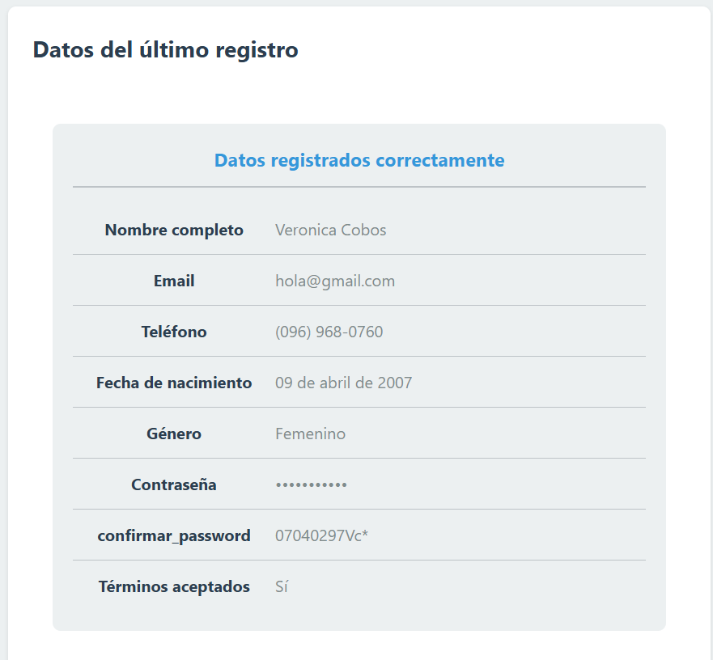  
Los datos se renderizan en una tarjeta con formato claro y organizado.

---

### Consola
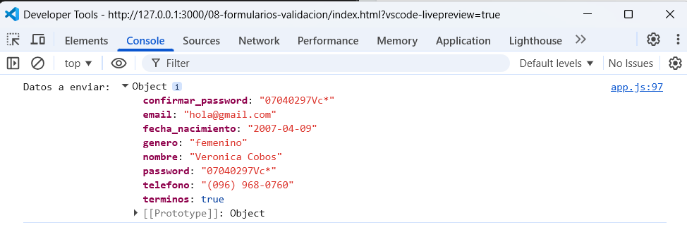  
Los datos del formulario también se imprimen en la consola para verificación técnica.

---

## Bloques principales de Validación y App

### ValidacionService.validarCampo(campo)
**Descripción:** Valida un campo individual según su tipo y nombre, aplicando reglas específicas (longitud, formato, coincidencia de contraseñas, etc.).
```js
validarCampo(campo) {
  const valor = campo.value.trim();
  const nombre = campo.name;
  const tipo = campo.type;
  let error = '';

  // Validar required
  if (campo.hasAttribute('required')) {
    if (tipo === 'checkbox') {
      if (!campo.checked) {
        error = 'Debes aceptar este campo';
      }
    } else if (!valor) {
      error = 'Este campo es obligatorio';
    }
  }

  // Validaciones específicas
  if (valor) {
    switch (nombre) {
      case 'nombre':
        if (valor.length < 3) error = 'El nombre debe tener al menos 3 caracteres';
        else if (valor.length > 50) error = 'El nombre no puede superar 50 caracteres';
        else if (!REGEX.soloLetras.test(valor)) error = 'El nombre solo puede contener letras y espacios';
        break;

      case 'email':
        if (!REGEX.email.test(valor)) error = 'Formato de email inválido';
        break;

      case 'telefono':
        if (!REGEX.telefono.test(valor.replace(/\D/g, ''))) {
          error = 'El teléfono debe tener exactamente 10 dígitos';
        }
        break;

      case 'fecha_nacimiento':
        const fechaNac = new Date(valor);
        const hoy = new Date();
        let edad = hoy.getFullYear() - fechaNac.getFullYear();
        if (hoy.getMonth() < fechaNac.getMonth() || 
           (hoy.getMonth() === fechaNac.getMonth() && hoy.getDate() < fechaNac.getDate())) {
          edad--;
        }
        if (edad < 18) error = 'Debes ser mayor de 18 años';
        else if (edad > 120) error = 'Fecha de nacimiento inválida';
        break;

      case 'password':
        if (valor.length < 8) error = 'La contraseña debe tener al menos 8 caracteres';
        else if (!/[A-Z]/.test(valor)) error = 'Debe tener al menos una letra mayúscula';
        else if (!/[a-z]/.test(valor)) error = 'Debe tener al menos una letra minúscula';
        else if (!/[0-9]/.test(valor)) error = 'Debe tener al menos un número';
        break;

      case 'confirmar_password':
        const password = document.querySelector('[name="password"]').value;
        if (valor !== password) error = 'Las contraseñas no coinciden';
        break;
    }
  }

  return { valido: error === '', error };
}
```
---

## ValidacionService.validarFormulario(form)
**Descripción:** Recorre todos los campos del formulario, aplica validaciones y muestra errores. Devuelve true si todo es válido.
```js
validarFormulario(form) {
  const campos = form.querySelectorAll('input, select, textarea');
  let todosValidos = true;

  campos.forEach(campo => {
    const resultado = this.validarCampo(campo);
    if (!resultado.valido) {
      mostrarError(campo, resultado.error);
      todosValidos = false;
    } else {
      limpiarError(campo);
    }
  });

  return todosValidos;
}
```
---
## ValidacionService.evaluarFuerzaPassword(password)
**Descripción:** Evalúa la fortaleza de una contraseña según longitud, mezcla de caracteres y símbolos especiales.

```js
evaluarFuerzaPassword(password) {
  let fuerza = 0;
  if (password.length >= 8) fuerza++;
  if (password.length >= 12) fuerza++;
  if (/[a-z]/.test(password) && /[A-Z]/.test(password)) fuerza++;
  if (/\d/.test(password)) fuerza++;
  if (/[^a-zA-Z0-9]/.test(password)) fuerza++;

  const niveles = [
    { texto: '', clase: '' },
    { texto: 'Muy débil', clase: 'muy-debil' },
    { texto: 'Débil', clase: 'debil' },
    { texto: 'Media', clase: 'media' },
    { texto: 'Fuerte', clase: 'fuerte' },
    { texto: 'Muy fuerte', clase: 'muy-fuerte' }
  ];

  return { nivel: niveles[fuerza].texto, clase: niveles[fuerza].clase, valor: fuerza };
}
```
---
## Funciones de UI
**Descripción:** Manejan la visualización de errores, limpieza de estados y formato automático del teléfono.

```js
function mostrarError(campo, mensaje) {
  campo.classList.add('campo--error');
  campo.classList.remove('campo--valido');
  const errorDiv = campo.parentElement.querySelector('.error-mensaje');
  if (errorDiv) errorDiv.textContent = mensaje;
}

function limpiarError(campo) {
  campo.classList.remove('campo--error');
  if (campo.value.trim() || (campo.type === 'checkbox' && campo.checked)) {
    campo.classList.add('campo--valido');
  } else {
    campo.classList.remove('campo--valido');
  }
  const errorDiv = campo.parentElement.querySelector('.error-mensaje');
  if (errorDiv) errorDiv.textContent = '';
}

function aplicarMascaraTelefono(input) {
  let valor = input.value.replace(/\D/g, '');
  if (valor.length > 10) valor = valor.slice(0, 10);
  if (valor.length > 6) valor = `(${valor.slice(0, 3)}) ${valor.slice(3, 6)}-${valor.slice(6)}`;
  else if (valor.length > 3) valor = `(${valor.slice(0, 3)}) ${valor.slice(3)}`;
  else if (valor.length > 0) valor = `(${valor}`;
  input.value = valor;
}
```
---

## app.js – Procesar envío
**Descripción:** Convierte los datos del formulario en objeto, simula envío, muestra mensaje de éxito, renderiza resultados y limpia el formulario.
```js
function procesarEnvio(formData) {
  const datos = Object.fromEntries(formData);
  datos.terminos = formRegistro.querySelector('#terminos').checked;

  console.log('Datos a enviar:', datos);

  mostrarMensajeTemporal(
    mensajeEstado,
    MensajeExito('Registro completado exitosamente. Los datos se muestran abajo.'),
    5000
  );

  renderizarResultado(datos, resultadoRegistro);
  formRegistro.reset();

  const campos = formRegistro.querySelectorAll('input, select, textarea');
  campos.forEach(campo => campo.classList.remove('campo--valido', 'campo--error'));

  passwordStrength.textContent = '';
  passwordStrength.className = 'password-strength';

  actualizarBotonEnviar(formRegistro);
  resultadoRegistro.scrollIntoView({ behavior: 'smooth', block: 'start' });
}
```
---
## app.js – Validar y enviar formulario
**Descripción:** Controla el envío del formulario: valida todos los campos, muestra errores si existen o procesa el envío si todo es correcto.
```js
formRegistro.addEventListener('submit', (e) => {
  e.preventDefault();
  const formularioValido = ValidacionService.validarFormulario(formRegistro);

  if (!formularioValido) {
    mostrarMensajeTemporal(
      mensajeEstado,
      MensajeError('Por favor, corrige los errores en el formulario antes de continuar.'),
      5000
    );
    const primerError = formRegistro.querySelector('.campo--error');
    if (primerError) {
      primerError.scrollIntoView({ behavior: 'smooth', block: 'center' });
      primerError.focus();
    }
    return;
  }

  const formData = new FormData(formRegistro);
  procesarEnvio(formData);
});
```
